<div align="center">

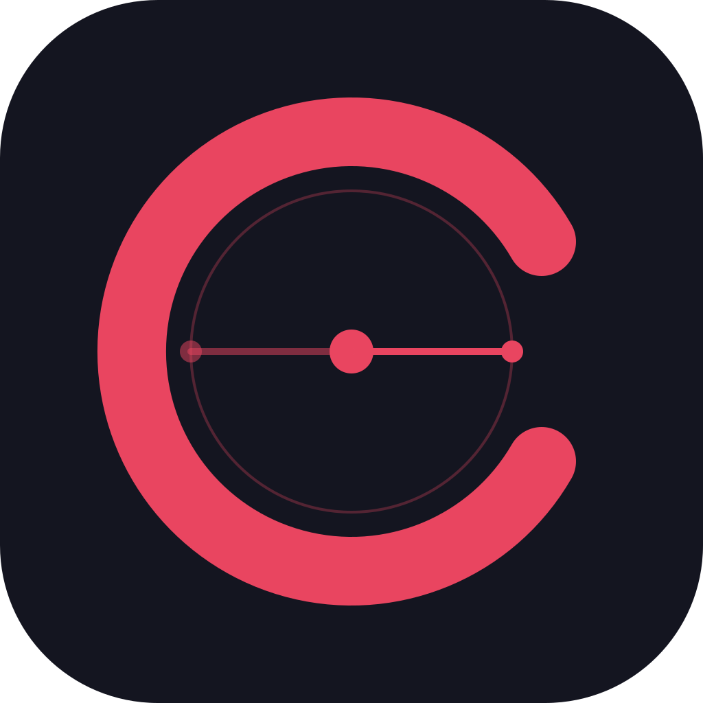

# Cinemate


**[🇮🇩 Bahasa Indonesia](#bahasa-indonesia) · [🇬🇧 English](#english)**

### Screenshots

<div align="center">

| Splash Screen | Login | Register |
|:---:|:---:|:---:|
| 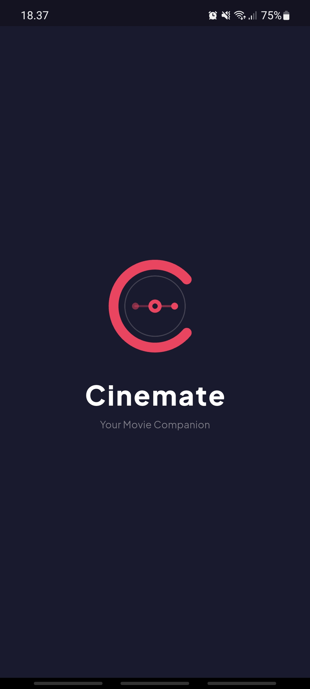 | 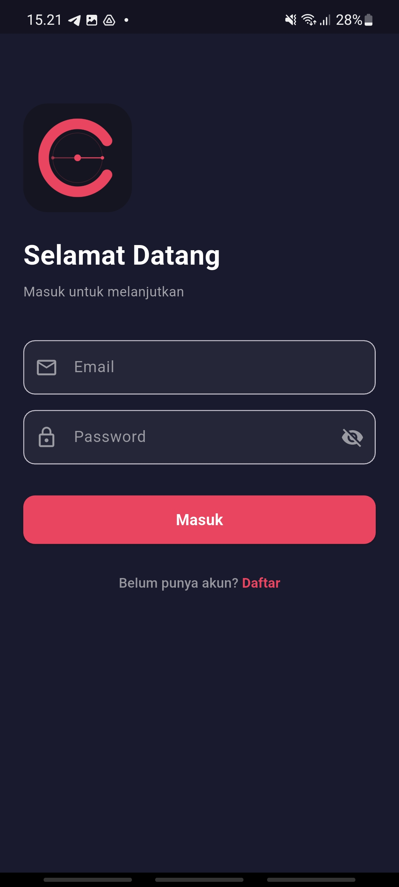 | 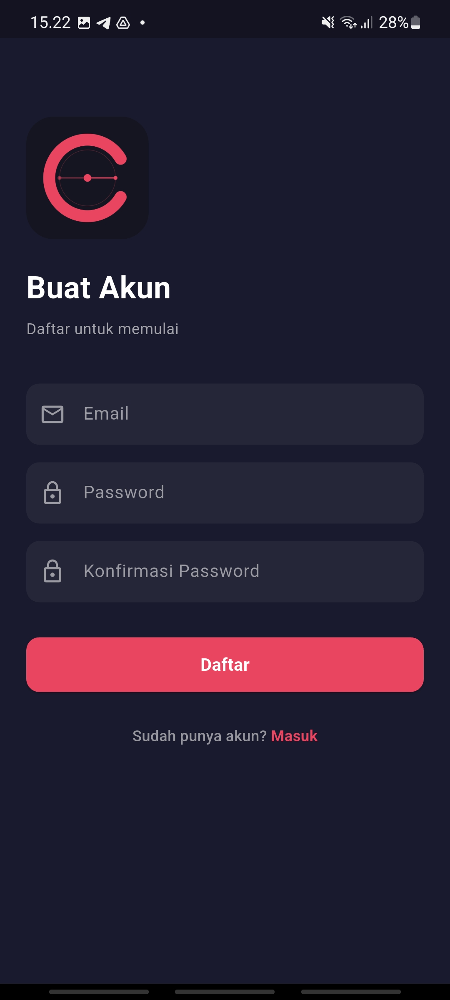 |

| Home Movies | Home TV Shows | Search |
|:---:|:---:|:---:|
| 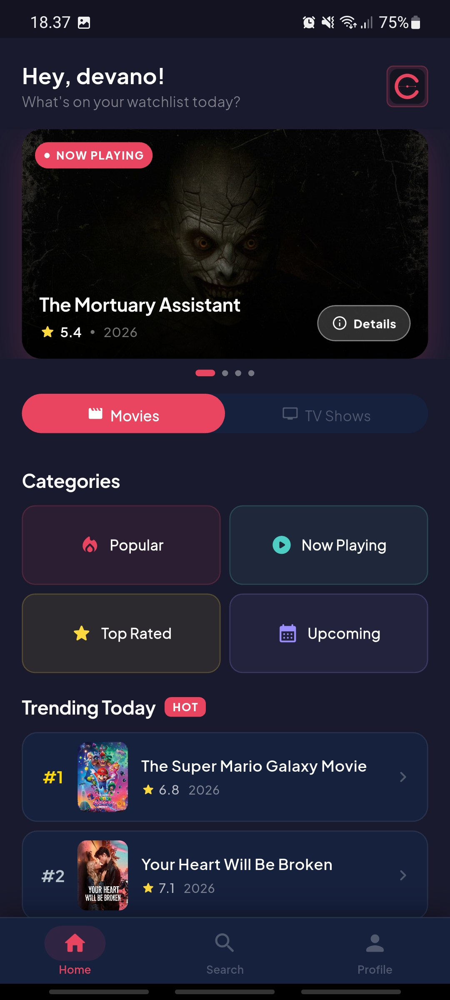 | 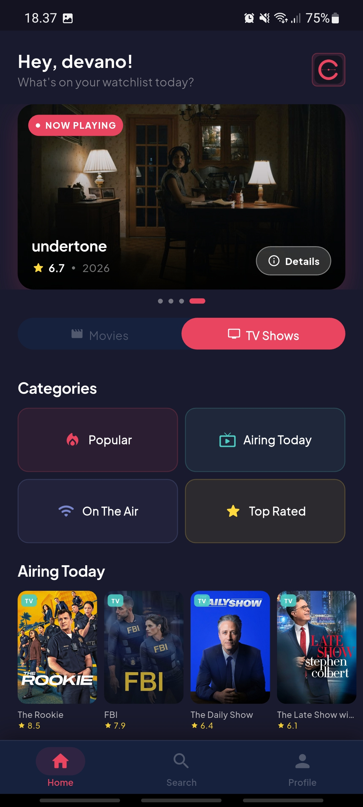 | 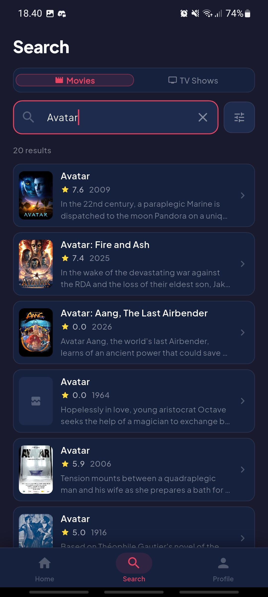 |

| List Movie | Movie Detail | TV Detail |
|:---:|:---:|:---:|
| 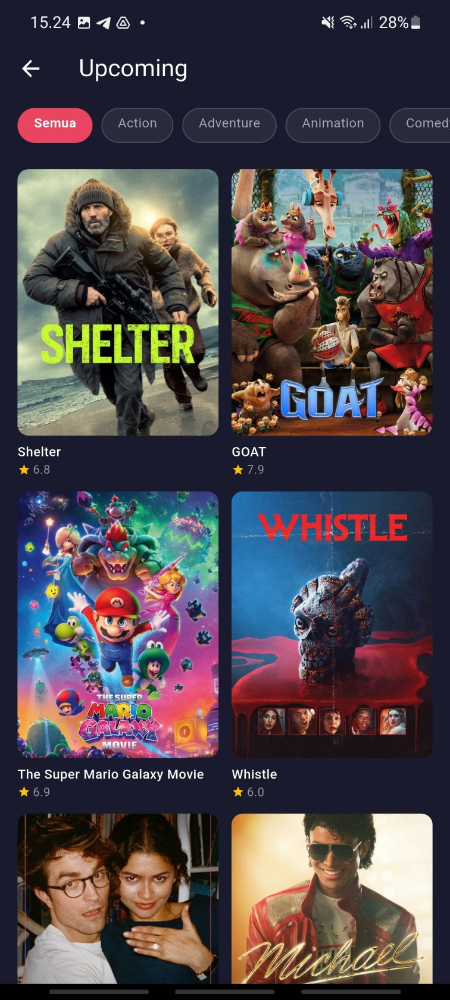 | 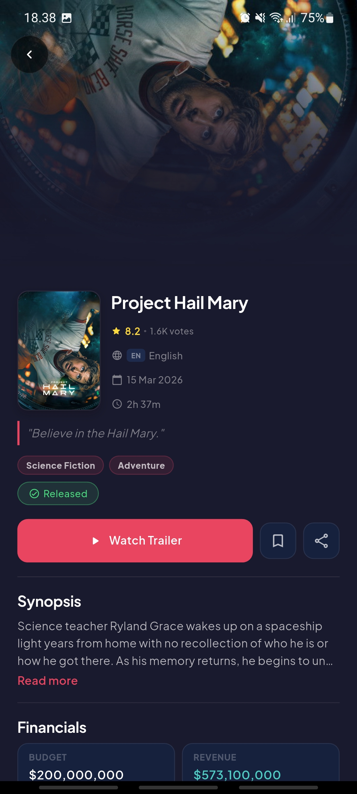 | 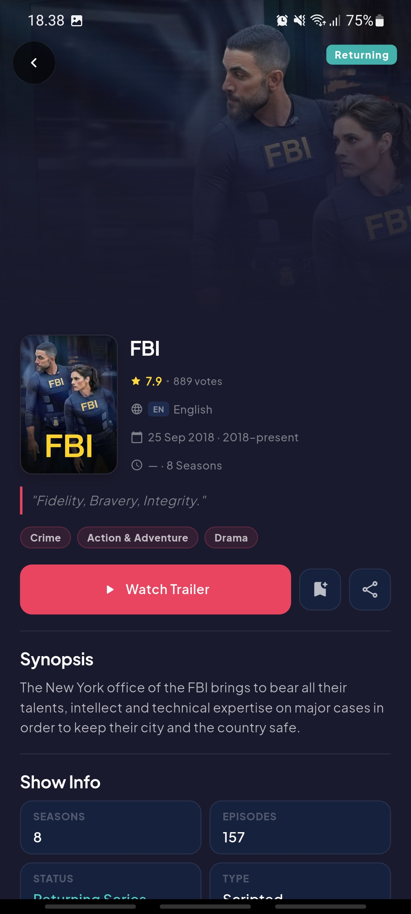 |

| Profile | My Watchlist |
|:---:|:---:|
| 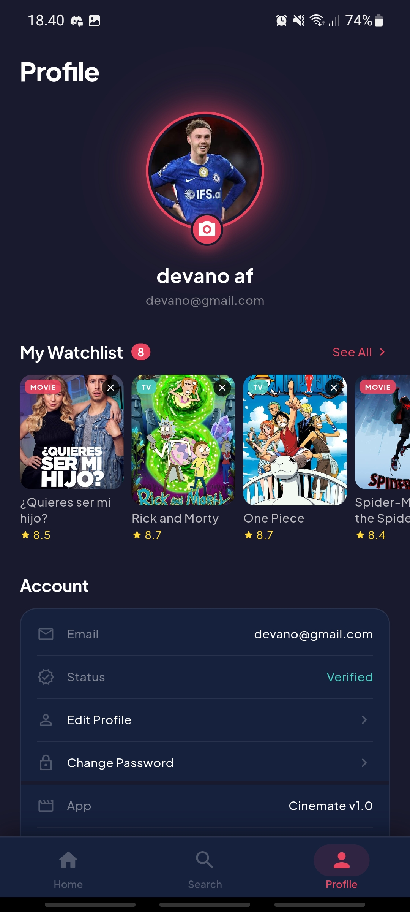 | 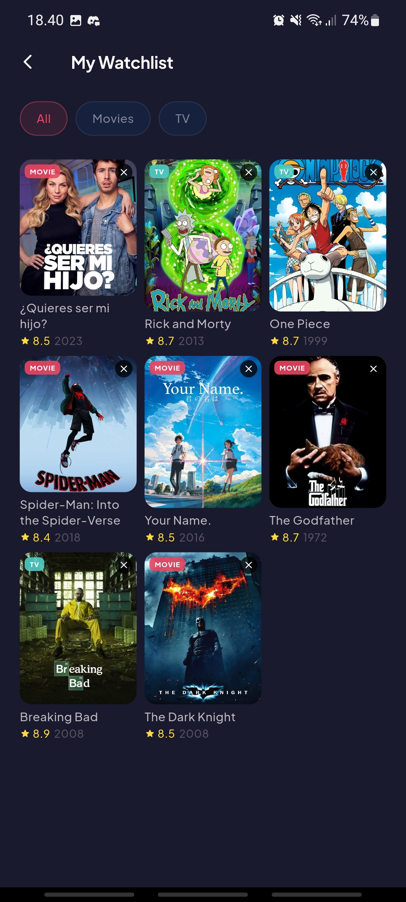 |

</div>

---

<a name="bahasa-indonesia"></a>
## 🇮🇩 Bahasa Indonesia

### Tentang Aplikasi

**Cinemate** adalah aplikasi mobile Android untuk mengeksplorasi film dan serial TV secara real-time. Data diambil dari [The Movie Database (TMDB) API](https://www.themoviedb.org/), dilengkapi autentikasi Firebase dan watchlist pribadi yang tersimpan di cloud.

### Fitur Utama

| Fitur | Keterangan |
|-------|------------|
| **Autentikasi** | Login & registrasi via Firebase (Email/Password) |
| **Home** | Hero banner, kategori film & TV, trending harian |
| **Pencarian** | Real-time search + fallback pencarian by nama aktor |
| **Film & Serial TV** | Browse Popular, Now Playing, Top Rated, Upcoming, Airing Today |
| **Infinite Scroll** | Pagination otomatis di semua halaman daftar |
| **Detail Lengkap** | Cast, ulasan, trailer, watch providers, similar, rekomendasi |
| **Watchlist** | Simpan film & serial TV, disinkronkan via Cloud Firestore |
| **Profil** | Edit nama, ganti foto profil, ganti password |
| **Share** | Bagikan film/serial ke aplikasi lain |

### Tech Stack

- **Framework:** Flutter (Dart)
- **State Management:** `flutter_bloc` — pola BLoC
- **Networking:** `dio` — HTTP client ke TMDB API
- **Backend:** Firebase Auth · Cloud Firestore · Firebase Storage
- **Navigation:** `go_router` — deklaratif dengan proteksi route
- **UI:** `cached_network_image` · `shimmer` · `google_fonts`
- **Utilities:** `flutter_dotenv` · `image_picker` · `url_launcher` · `share_plus`

### Arsitektur

```
Presentation Layer   →  screens/ + bloc/ + widgets/
Data Layer           →  data/services/ + data/models/
Core Layer           →  core/constants/ + core/routes/ + core/theme/
```

Setiap fitur dikelola oleh BLoC tersendiri: `AuthBloc`, `MovieBloc`, `TvBloc`, `WatchlistBloc`.

### Cara Menjalankan

```bash
# 1. Clone repository
git clone https://github.com/devanoahmadd/cinemate.git
cd cinemate

# 2. Buat file .env dari template
cp .env.example .env
# Isi TMDB_ACCESS_TOKEN di dalam .env

# 3. Install dependencies
flutter pub get

# 4. Jalankan aplikasi
flutter run
```

> Pastikan sudah menyiapkan `google-services.json` dari Firebase Console dan meletakkannya di `android/app/`.

### Dokumentasi

- [DOKUMENTASI.md](DOKUMENTASI.md) — Spesifikasi teknis lengkap (Bahasa Indonesia)
- [DOCUMENTATION.md](DOCUMENTATION.md) — Full technical specification (English)

---

<a name="english"></a>
## 🇬🇧 English

### About

**Cinemate** is an Android mobile application for exploring movies and TV shows in real-time. Data is fetched from the [The Movie Database (TMDB) API](https://www.themoviedb.org/), with Firebase authentication and a personal cloud-backed watchlist.

### Key Features

| Feature | Description |
|---------|-------------|
| **Authentication** | Login & registration via Firebase (Email/Password) |
| **Home** | Hero banner, movie & TV categories, daily trending |
| **Search** | Real-time search + actor name fallback search |
| **Movies & TV Shows** | Browse Popular, Now Playing, Top Rated, Upcoming, Airing Today |
| **Infinite Scroll** | Automatic pagination on all list screens |
| **Rich Detail** | Cast, reviews, trailer, watch providers, similar, recommendations |
| **Watchlist** | Save movies & TV shows, synced via Cloud Firestore |
| **Profile** | Edit display name, change profile photo, change password |
| **Share** | Share movie/show details to other apps |

### Tech Stack

- **Framework:** Flutter (Dart)
- **State Management:** `flutter_bloc` — BLoC pattern
- **Networking:** `dio` — HTTP client for TMDB API
- **Backend:** Firebase Auth · Cloud Firestore · Firebase Storage
- **Navigation:** `go_router` — declarative routing with route protection
- **UI:** `cached_network_image` · `shimmer` · `google_fonts`
- **Utilities:** `flutter_dotenv` · `image_picker` · `url_launcher` · `share_plus`

### Architecture

```
Presentation Layer   →  screens/ + bloc/ + widgets/
Data Layer           →  data/services/ + data/models/
Core Layer           →  core/constants/ + core/routes/ + core/theme/
```

Each feature is managed by its own BLoC: `AuthBloc`, `MovieBloc`, `TvBloc`, `WatchlistBloc`.

### Getting Started

```bash
# 1. Clone the repository
git clone https://github.com/devanoahmadd/cinemate.git
cd cinemate

# 2. Create .env from the template
cp .env.example .env
# Fill in your TMDB_ACCESS_TOKEN inside .env

# 3. Install dependencies
flutter pub get

# 4. Run the app
flutter run
```

> Make sure to place `google-services.json` from the Firebase Console into `android/app/`.

### Documentation

- [DOCUMENTATION.md](DOCUMENTATION.md) — Full technical specification (English)
- [DOKUMENTASI.md](DOKUMENTASI.md) — Spesifikasi teknis lengkap (Bahasa Indonesia)

---

<div align="center">

Made by **Devano Ahmad Fadloli** · Flutter Bootcamp Final Project

</div>
